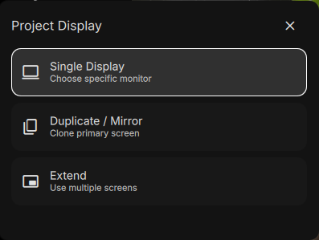

# Display Output

A Hyprland DankMaterialShell plugin that allows you to manage your display outputs (PC Only, Mirror, Extend, Second Screen Only).

> **Credit & Acknowledgement:**
> This project is a modified fork of the [Display Settings](https://github.com/Lucyfire/dms-plugins/tree/master/displaySettings) plugin originally created by [Lucyfire](https://github.com/Lucyfire).



## Features

Registers 3 new ipc calls to dms

- `dms ipc call displayOutput toggle`
- `dms ipc call displayOutput open`
- `dms ipc call displayOutput close`

## Installation

### From Plugin Registry (Recommended)

You can easily install this plugin directly using the DMS plugin manager:
```bash
dms plugins install displayOutput
```

Then, enable the plugin in the DMS plugins tab, or run the following command to display the menu:
```bash
dms ipc call displayOutput toggle
```

### Manual Installation via Git
Since this is a standalone plugin, you can install it by cloning this repository directly into your DMS plugins folder.

Clone this repository:
```bash
git clone https://github.com/xyzsteven/dms-displayoutput.git
```

Copy the contents to the DMS plugins directory as `displayOutput`:
```bash
cp -r dms-displayoutput ~/.config/DankMaterialShell/plugins/displayOutput
```

You can now delete the cloned repo if you want:
```bash
rm -rf dms-displayoutput
```

Enable the plugin in the DMS plugins tab, or run the following command to display the menu:
```bash
dms ipc call displayOutput toggle
```

## Configuration

None at the moment.

## Requirements

- DankMaterialShell >= 1.4.0
- Hyprland
    - a monitorv2 definition in your hyprland.conf file.

## Compatibility

- **Compositors**: Hyprland
- **Distros**: Universal - works on any Linux distribution

## Contributing

Honestly, this project is mostly the result of "vibe coding" just me tinkering around, experimenting, and making things work for my own daily setup. I'm not running a strict or formal development cycle here!

If you find bugs, have cool ideas, or want to make it better, feel free to open an issue, submit a pull request, or just fork it and go wild. Just keep in mind that I review things at a pretty relaxed pace. We're all just here to have fun customizing our desktops!

## License

MIT License - See LICENSE file for details